# Nama: Nahrul Wijaya
# Nim : 31020415
# Kelas: TI.20.A1

## Langkah-Langkah praktikum 3

Membuka editor teks, Saya menggunakan teks Sublime
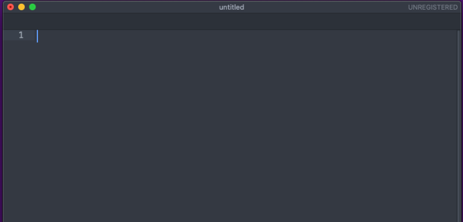

# 1. Membuat Daftar Pesanan

tambahkan kode untuk membuat Ordered List seperti berikut.
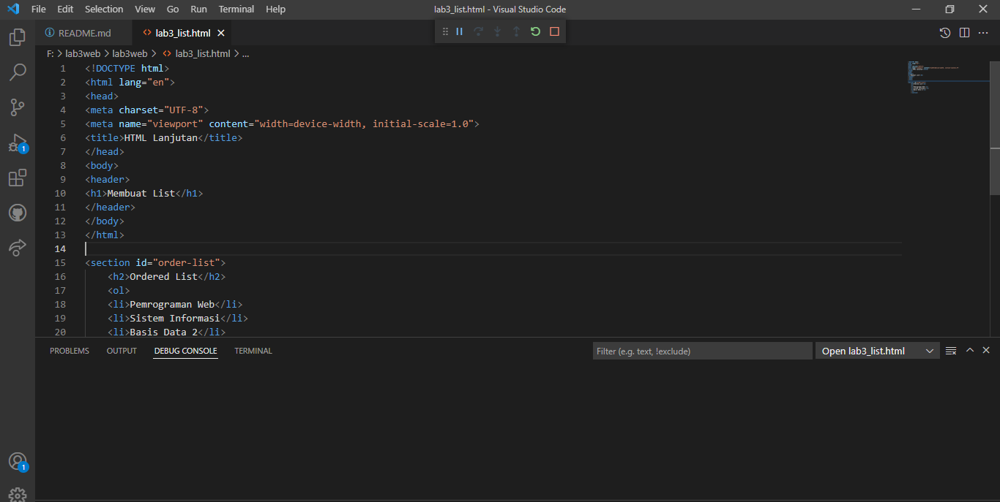

# Hasilnya
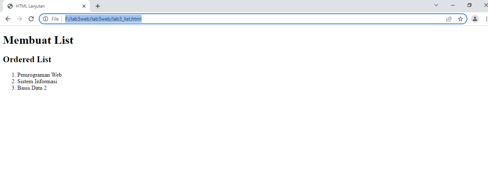

# 2. Membuat Daftar Unordered

Kemudian tambakan kode untuk membuat Unordered List, setelah deklarasi diurutkan list pada section unordered-list, seperti berikut.

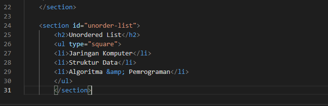

# Hasilnya
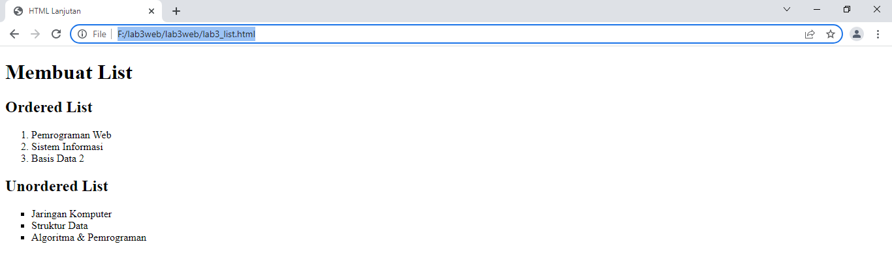

# 3. Membuat Daftar Deskripsi

Kemudian tambahkan kode untuk membuat daftar deskripsi setelah deklarasi unorderd-list.

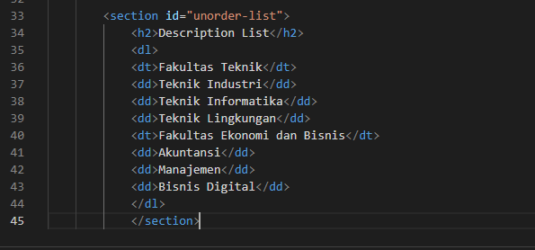

# Hasilnya

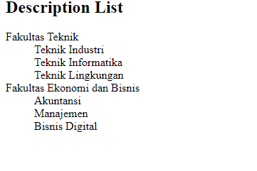

# 4. Membuat Tabel

Buat file baru dengan nama lab3_tabel.html, kemudian tambahkan kode untuk membuat tabel sederhana seperti berikut:

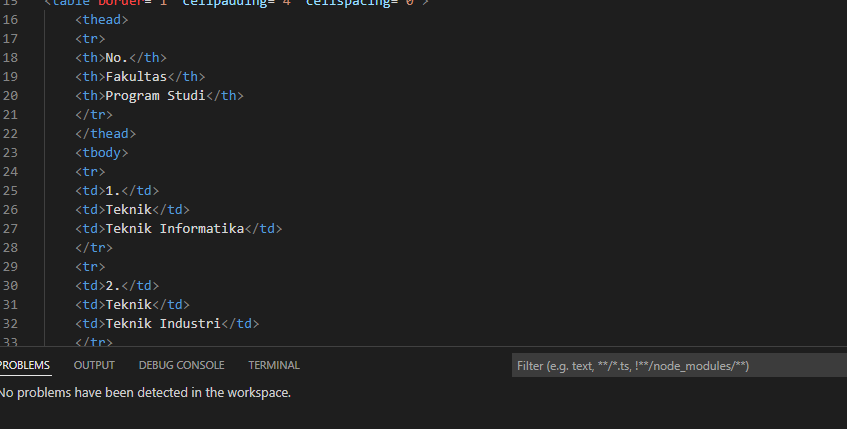

# Hasilnya
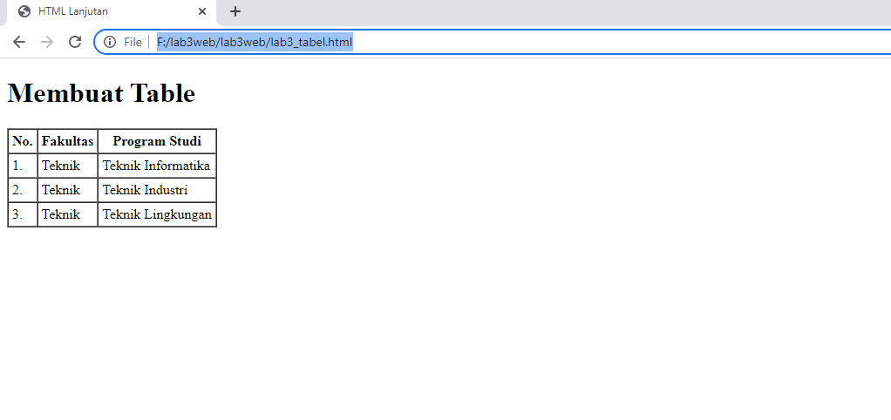

# 5. Margin & Padding

Untuk mengatur margin dan padding pada cel data, tambahkan atribut cellpadding dan cellspacing pada tag table.

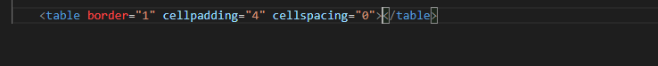

# Hasilnya
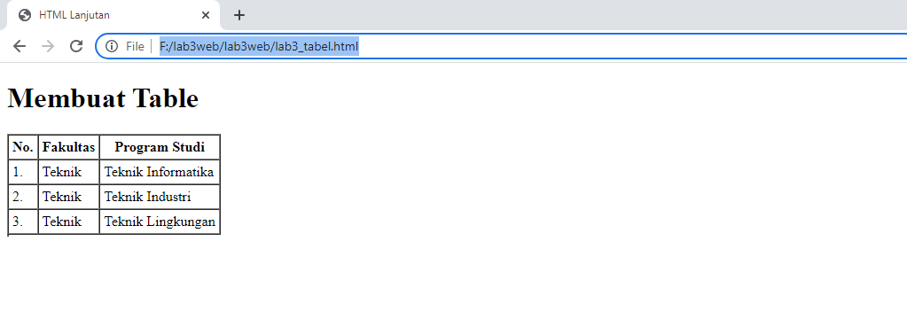

# 6. Menggabungkan Sel Data

Untuk menggabungkan data sel, gunakan atribut rowspan dan colspan. Atribut rowspan untuk menggabungkan baris (secara vertikal) dan colspan untuk menggabungkan kolom (secara horizontal).

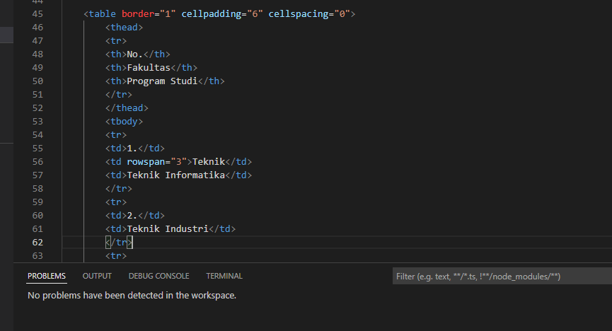

# Hasilnya
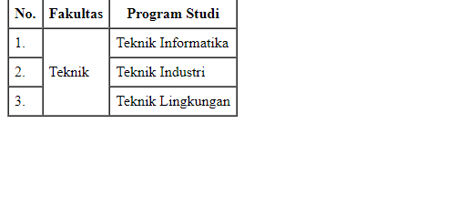

# 7. Membuat Bentuk

Buat file baru dengan nama lab3_form.html, Kemudian tambahkan kode untuk membuat tabel sederhana seperti berikut:

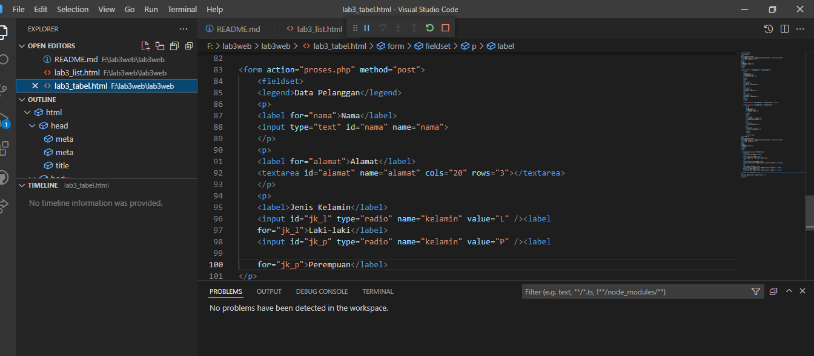

# Hasilnya
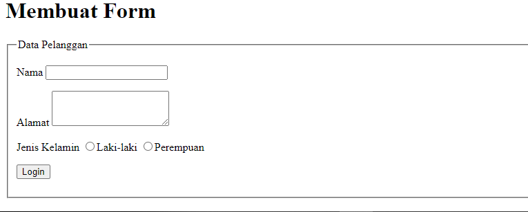

# 8. Penambahan style pada Form

Agar tampilan form lebih menarik, bisa ditambahkan CSS seperti berikut.

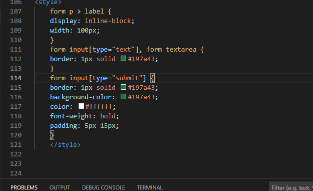

# Hasilnya
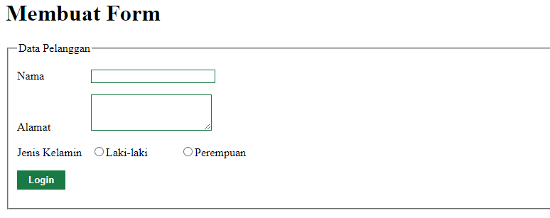

## Pertanyaan dan Tugas

# 1.Buatlah form yang menampilkan dropdown menu dan listbox dengan multiple selection.

## Jawaban

# 1.HTML

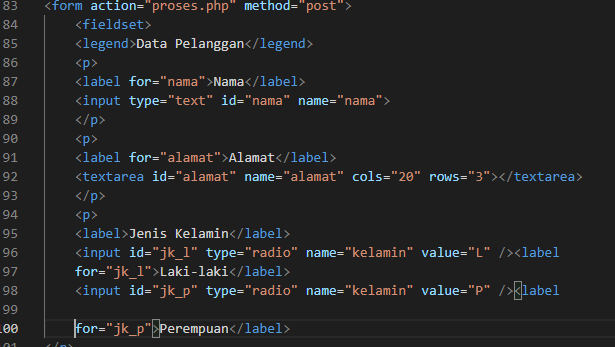

# CSS

# Keluaran

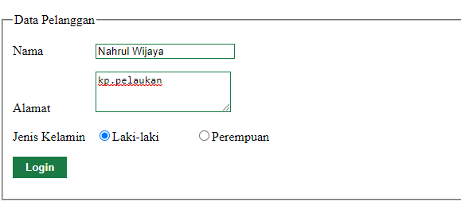